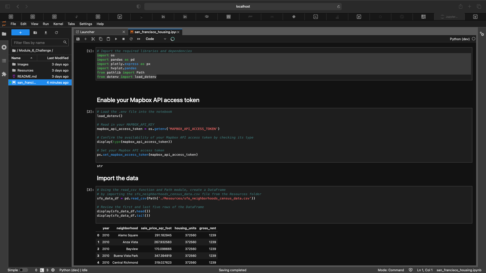
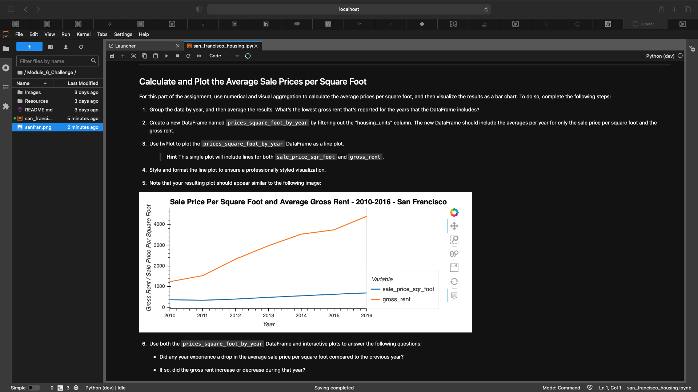
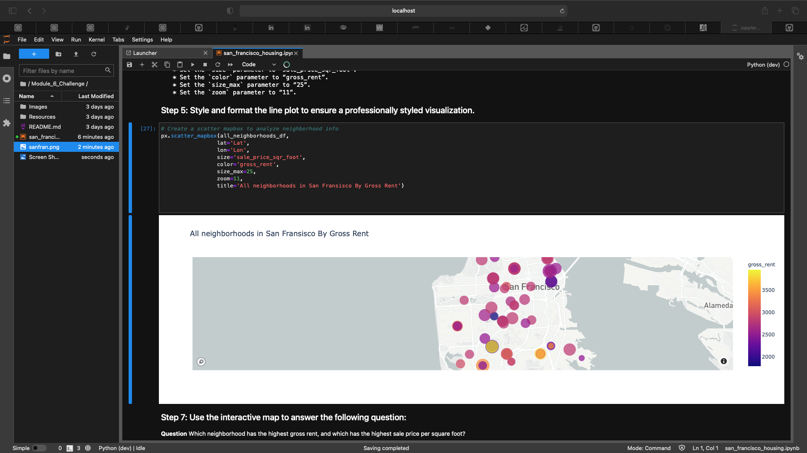

Housing Rental Analysis Using MAPBOX API

---

This is a Jupyter Lab via command line interface created code used with the assitance of Pandas to create an analysis of the housing prices per square ft and the avgerage rental cost per neighborhood in the San Francisco area to determine which neighborhood presented the best investment opportunities.

## Technologies

This project uses python 3.7 with the following packages:

* [Pandas](https://github.com/pandas-dev/pandas) - Pandas is an open-source library that offers easy-to-use data analysis tools for Python.

* [Jupyter Lab](https://github.com/jupyterlab/jupyterlab-git) - For interactive analysis prompts and a code as you code structure

* [MapBox API](https://docs.mapbox.com) - For sofisticated map plotting


 
---

## Installation Guide

Before running the application first install the following:


* [Install] Anaconda with Python 3.7+(https://docs.anaconda.com/anaconda/install/)
You should always be in a conda dev environment when launching JupyterLab.

```python
 conda install -c plotly plotly=4.13.
 conda install -c pyviz hvplot
 conda install -c conda-forge nodejs=12

```
As well as Jupyter Lab Extensions

```python

conda install -c conda-forge jupyterlab=2
jupyter labextension install jupyterlab-plotly@4.13.0 --no-build
jupyter labextension install @jupyterlab-widgets/hupyterlab-manager plotlywidget@4.13.0 --no-build
jupyter labextension install @pyviz/jupyterlab_pyvoz --no-build
jupyter lab build

```
* [Create] MAPBOX API KEY(https://account.mapbox.com/auth/signup/)


---

## Import the following libraries and dependencies 

```python
import os
import pandas as pd
import plotly.express as px
import hvplot.pandas
from pathlib import Path
from dotenv import load_dotenv
```
---

## Usage

To view the san_francisco_housing.ipynb, open Terminal/ Use CLI

```conda activate dev
cd <location of (san_francisco_housing.ipynb)>
jupyter lab
```

Upon launching the Jupyter Lab application you will be greeted with the following prompts.




As Well as the following Visualizations.






---

## Contributors

Brought to you by MartyCodes333 (martique.henton@gmail.com) with the help of 2021 UW FinTech Bootcamp Instructors, TA's and Fellow Classmates


---